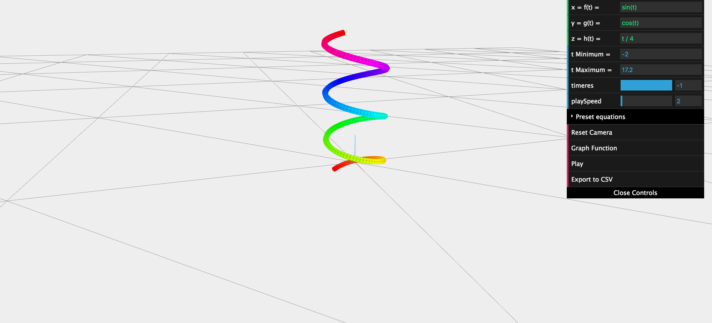

## Features

* Build trajectories with parametrized curve equation $x = f(t), y = g(t), z = h(t)$.
* Animate the trajectory.
* Export to CSV files.

## Setup

To interact with the trajectory builder, first install a simple http server

```
sudo npm install -g http-server
```

Then run the server with `http-server` and navigate to 
[http://127.0.0.1:8080/curve.html](http://127.0.0.1:8080/curve.html).

## Screenshots




